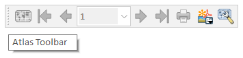

## Atlas tool bar

*  Anteprima atlante - attiva disattiva atlanta

*  Prima geometria atlante

*  Geometria precedente atlante

*   nome pagina altlanteImpostazione Atlante

*  Geometria successiva atlante

*  Ultima geometria dell'atlante

*   Stampa Atlante

*   Esporta atlante come immagine, SVG o PDF

*   Impostazione Atlante
