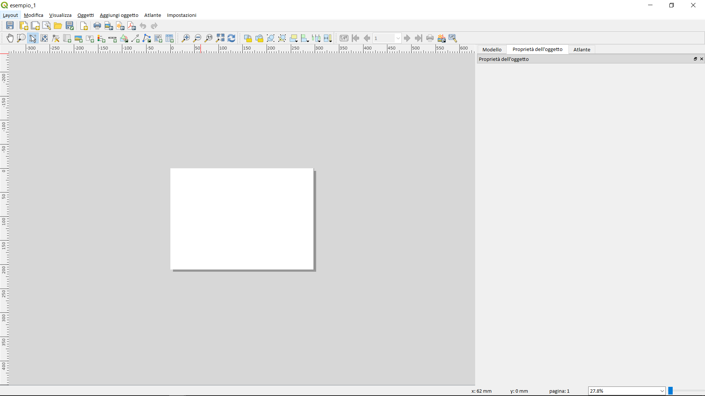
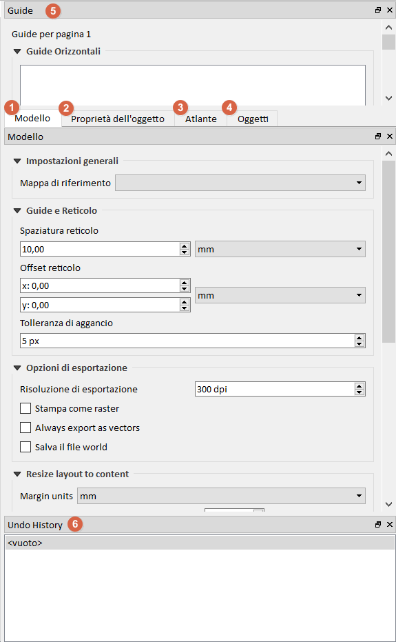
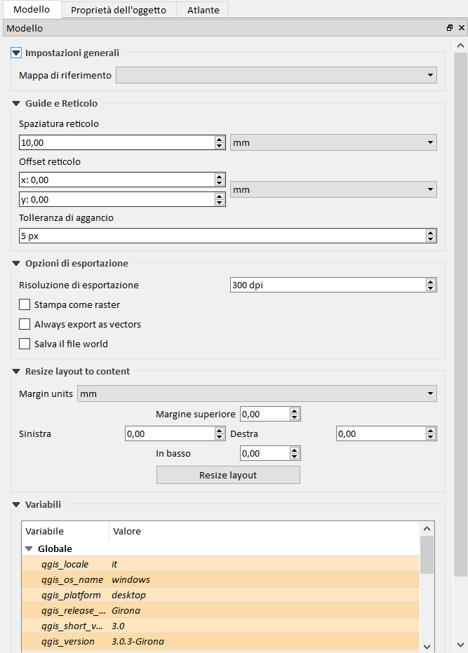
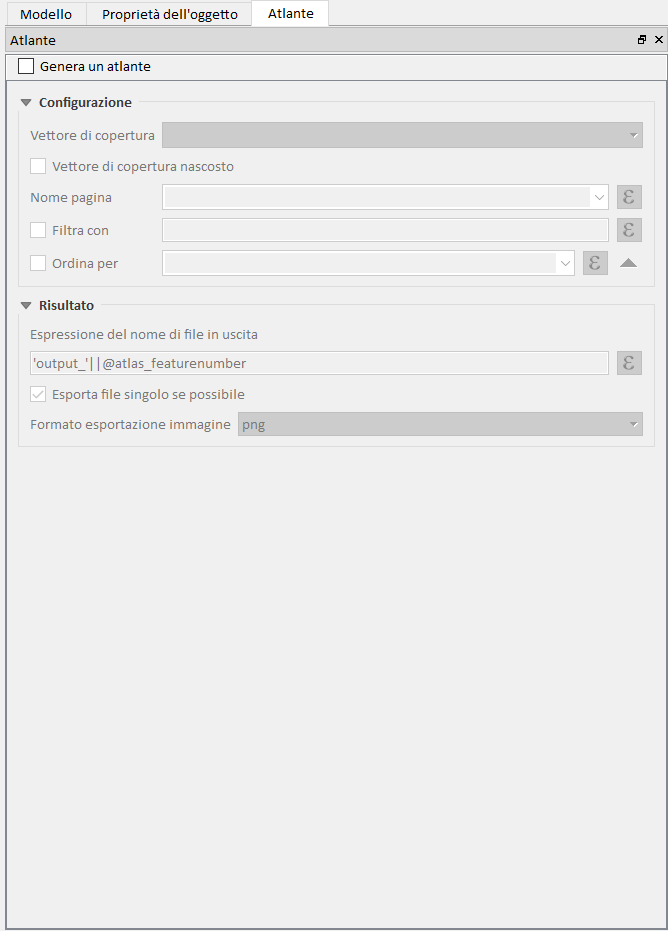

## Interfaccia 

dopo `CTRL+P` l'interfaccia di presenta cosi:

Elementi dell'interfaccia:

### Tools bar

#### [Layout toolbar](layout_toolbar.md)

#### [Strumenti](strumenti.md)

#### [Navigator tool bar](navigator.md)

#### [Actions tool bar](actions_tool_bar.md)

#### [Atlas tool bar](atlas_tool_bar.md)

### Pannelli

#### Menu Visualizza

#### Vista complessiva

#### Modello

#### Proprietà dell'oggetto

NB: selezionare oggetto e poi tasto destro mouse per le proprietà:

#### Atlante

#### Guide

#### Undo History

