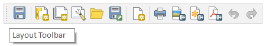

## Layout toolbar

*  Salva progetto

*  Nuovo modello di stampa

*  Duplica il modello di stampa

*  Gestore del layout (apre una finestra per gestire i layout)

*  Aggiunge oggetto da modello layout (file.QTP)

*  Salva come modello layout (file.QTP)

*  Inserisce pagina

*  Stampa layout

*  Esporta come immagine

*  Esporta come SVG

*  Esporta come PDF

*  Annulla

*  Rifai
