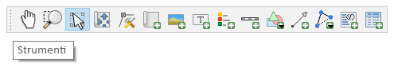
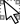
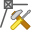
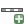
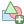

## Strumenti

*  Sposta (pan) layout `P`

*  Zoom area rettangolare `Z`

*  Seleziona e spsta oggetto `V`

*  Sposta contenuto oggetto `C`

*  Modifica nodi

*  Aggiungi una nuova mappa la layout

*  Inserisce una nuova immagine al layout

*  Aggiungi una nuova etichetta al layout

*  Aggiungi una nuova legenda al layout

*  Aggiungi una nuova barra di scala al layout

*  Aggiungi forma

*  Aggiungi una nuova freccia al layout

*  Aggiungi un elemento a nodi al layout

*  Aggiungi un nuovo HTML al layout

*  Aggiungi una nuova tabella attributi al layout

